# 1. UML概述

## 1.1 什么是 UML？

UML 是 OMG 在1997年1月提出了创建由对象管理组和 UML1.0 规范草案；

UML 是一种为面向对象开发系统的产品进行说明、可视化、和编制文档的标准语言；

UML 作为一种模型语言，它使开发人员专注于建立产品的模型和结构，而不是选用什么程序语言和算法实现；

UML 是不同于其他常见的编程语言，如C + +，Java中，COBOL等，它是一种绘画语言，用来做软件蓝图；

UML 不是一种编程语言，但工具可用于生成各种语言的代码中使用UML图；

UML 可以用来建模非软件系统的处理流程，以及像在一个制造单元等.

## 1.2 UML 的目标：

UML 的目标是定义一些通用的建模语言并对这些建模语言做出简单的说明，这样可以让建模者理解与使用。UML 也是为普通人和有兴趣的人而开发的系统，它可以是一个软件或者使用非软件，它必须是明确的。我们不将 UML 作为一个开发方法，而是随着流程做一个成功的系统。

现在我们可以明确的了解 UML 的目标就是 UML 被定义为一个简单的建模机制，帮助我们按照实际情况或者按照我们需要的样式对系统进行可视化；提供一种详细说明系统的结构或行为的方法；给出一个指导系统构造的模板；对我们所做出的决策进行文档化。

## 1.3 UML 面向对象的概念：

面向对象(Object Oriented,OO)是软件开发方法，面向对象的概念和应用已超越了程序设计和软件开发。我们可以将 UML 描述为面向对象的分析和设计的继任者。

一个对象中包含了数据和控制数据的方法，其中数据表示对象的状态，类描述的对象，他们也形成层次结构模型真实世界的系统。表示为继承层次结构，也可以以不同的方式按要求相关的类。

对象是现实世界的实体存在我们周围像抽象，封装，继承，多态的基本概念，都可以使用UML表示。因此，UML 是强大到足以代表所有的概念存在于面向对象的分析和设计。 

UML 图是面向对象的概念的表示，因此，学习UML之前，详细了解面向对象的概念就变得非常重要。

以下是一些面向对象基本概念：

- **对象:** 对象代表一个实体的基本构建块.
- **类:** 类是对象的蓝图.
- **抽象化:** 抽象代表现实世界中实体的行为.
- **封装:** 封装是将数据绑定在一起，并隐藏他们外部世界的机制。
- **继承:** 继承是从现有的机制作出新的类。
- **多态性:** 定义的机制来以不同的形式存在.

# 2. UML快速学习指南

## 2.1 UML 注释:

UML 中最重要的建模元素是符号。

适当有效地使用符号对于一个完整的，有意义的模型来说是非常重要的。如果一个模型的目的无法正确的描绘，那么该模型是无用的。

因此，在开始学习 UML 的时候就要强调表示法的重要性，不同的符号可用于表示物件和关系。

可扩展性是 UML 的另一个重要的特点，这使得UML更加强大和灵活。

## 2.2 UML 核心:

UML 的核心是图表，大致可以将这些图归类为结构图和行为图。

- 结构图是由静态图，如类图，对象图等静态图；
- 行为图是由像序列图，协作图等动态图；

一个系统的静态和动态特性是通过使用这些图的可视化。

## 2.3 UML 类图:

类图是使用面向对象的社会最流行的 UML 图。它描述了在一个系统中的对象和他们的关系，能够让我们在正确编写代码以前对系统有一个全面的认识。

一个单独的类图描述系统的一个具体方面，收集类图表示整个系统。基本上，类图表示系统的静态视图。

类图是唯一可以直接映射到面向对象的语言UML图。因此，它被广泛应用于开发者社区。

## 2.4 UML 对象图：

对象图是类图的一个实例。因此，一类图的基本要素是类似的。对象图是由对象和链接。在一个特定的时刻，它捕获该系统的实例。

对象图用于原型设计，逆向工程和实际场景建模。

## 2.5 UML 组件图：

组件图是一种特殊的UML图来描述系统的静态实现视图。组件图包括物理组件，如库，档案，文件夹等。

此图是用来从实施的角度。使用一个以上的元件图来表示整个系统。正向和逆向工程技术的使用，使可执行文件组件图。

## 2.6 UML 部署图：

组件图是用来描述一个系统的静态部署视图。这些图主要用于系统工程师。

部署图是由节点和它们之间的关系。一个高效的部署图是应用软件开发的一个组成部分。

## 2.7 UML 用例图:

用例图是从用户角度描述系统功能，并指出各功能的操作者，用来捕捉系统的动态性质。

一个高层次的设计用例图是用来捕捉系统的要求，因此它代表系统的功能和流向。虽然用例图的正向和反向工程是不是一个很好的选择，但他们仍然在一个稍微不同的方法来模拟它。

## 2.8 UML 交互图：

交互图，用于捕获系统的动态性质。

交互图包括序列图和协作图，其中：序列图显示对象之间的动态合作关系，它强调对象之间消息发送的顺序，同时显示对象之间的交互；协作图描述对象间的协作关系，协作图跟时序图相似，显示对象间的动态合作关系。

## 2.9 UML 状态图：

状态图是一个用于模拟系统的动态性质的五个图。这些图用来模拟一个对象的整个生命周期。

一个对象的状态被定义为对象所在的条件下，特定的时间和对象移动对其他状态，在某些事件发生时。状态图还用于正向和反向工程。

状态图着重描述从一个状态到另一个状态的流程，主要有外部事件的参与。

## 2.10 UML 活动图：

活动图是 UML 的动态模型的一种图形，一般用来描述相关用例图，活动图是一种特殊的状态图。

准确的活动图定义：活动图描述满足用例要求所要进行的活动以及活动间的约束关系，有利于识别并行活动。活动图是一种特殊的状态图，它对于系统的功能建模特别重要，强调对象间的控制流程。

# 3. UML构建模块

复习上节内容，在上节内容中我们知道 UML 的概念模型需要掌握的三大要素是：

- UML构建模块
- 规则连接构建模块
- UML的公共机制

本节讲解 UML 构建模块的所有要素，UML 的构建块的定义如下：

- 事物
- 关系
- 图

## 3.1 事物:

事物是是实体抽象化的最终结果，是 UML 构建块最重要的组成部分，事物的分类如下:

- 结构事物
- 行为事物
- 分组事物
- 注释事物

### 3.1.1 结构事物:

结构事物是模型中的静态部分，用以呈现概念或实体的表现元素，是软件建模中最常见的元素，接下来是对结构化物件的简要描述：

**类**

类是指具有相同属性、方法、关系和语义的对象的集合；

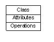

**接口**

接口是指类或组件所提供的服务（操作），描述了类或组件对外可见的动作；

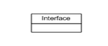

**协作**

协作定义元素之间的相互作用；

**用例**

用例定义了执行者（在系统外部和系统交互的人）和被考虑的系统之间的交互来实现的一个业务目标；

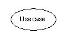

**组件**

组件描述物理系统的一部分；

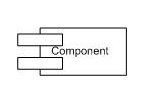

**节点**

一个节点可以被定义为在运行时存在的物理元素；

### 3.1.2 行为事物:

行为事物指的是 UML 模型中的动态部分，代表语句里的 "动词"，表示模型里随着时空不断变化的部分，包含两类：

**交互:**

交互被定义为一种行为，包括一组元素之间的消息交换来完成特定的任务。

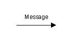

**状态机:**

状态机由一系列对象的状态组成，它是有用的，一个对象在其生命周期的状态是很重要的。

### 3.1.3 分组事物:

可以把分组事物看成是一个"盒子"，模型可以在其中被分解。目前只有一种分组事物，即包（package）。结构事物、动作事物甚至分组事物都有可能放在一个包中。包纯粹是概念上的，只存在于开发阶段，而组件在运行时存在。

**包:**

封装是唯一一个分组事物可收集结构和行为的东西。

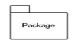

### 3.1.4 注释事物:

注释事物可以被定义为一种机制来捕捉UML模型元素的言论，说明和注释。注释是唯一一个注释事物。

**注释:**

注释用于渲染意见，约束等的UML元素。

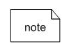

## 3.2 关系 :

关系是另一个最重要的构建块UML，它显示元素是如何彼此相关联，此关联描述的一个应用程序的功能，UML中定义了四种关系：

### 3.2.1 依赖关系:

依赖是两件事物之间的语义联系，其中一个事物的变化也影响到另一个事物。

### 3.2.2 协作:

一种描述一组对象之间连接的结构关系，如聚合关系（描述了整体和部分间的结构关系）；

### 3.2.3 泛化:

泛化可以被定义为一个专门的元件连接关系与一个广义的元素，它基本上描述了在对象世界中的继承关系，是一种一般化-特殊化的关系；

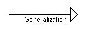

### 3.2.4 实现:

类之间的语义关系，其中的一个类指定了由另一个类保证执行的契约。

## 3.3  UML图:

UML 图的整个讨论的最终输出所有要素，关系用于使一个完整的UML图，图中表示的系统。

UML 图的视觉效果是整个过程中最重要的部分。

图是事物集合的分类，UML 中包含多种图：

1. 类图：类图描述系统所包含的类、类的内部结构及类之间的关系；
2. 对象图：对象图是类图的一个具体实例；
3. 用例图：用例图从用户的角度出发描述系统的功能、需求，展示系统外部的各类角色与系统内部的各种用例之间的关系；
4. 顺序图：顺序图表示对象之间动态合作的关系；
5. 协作图：协作图描述对象之间的协作关系；
6. 活动图：活动图描述系统中各种活动的执行顺序。
7. 状态图：状态图描述一类对象的所有可能的状态以及事件发生时状态的转移条件；
8. 部署关系图：部署关系图定义系统中软硬件的物理体系结构；
9. 组件图：组件图描述代码部件的物理结构以及各部件之间的依赖关系；

# 4. UML基本表示法

UML 中最重要的建模元素是符号，一个完整的、有意义的模型要适当有效地使用符号，如果一个模型中的目的没有被正确描述，则该模型是无用的。所以学习符号应该从一开始就强调。

UML 图使用不同的符号来表示事物和关系；可扩展性是另一个重要的功能，这使得UML更加强大和灵活。

本章还介绍更详细的 UML 基本表示法。这仅仅是一个扩展的 UML 构建块段，已经在前面的章节中讨论。

## 4.1 结构事物:

用图形表示法中使用的结构事物是 UML 中最广泛使用的，这些被认为是为UML模型的名词。

以下是结构事物的列表。

- 类
- 接口
- 协作
- 用例
- 活动类
- 组件
- 节点

**类注释:**

下面的图表示的 UML 类，该图被分为四个部分。

- 顶端部分被用来命名类。
- 第二个是用来显示类的属性。
- 第三部分是用来描述由类执行的操作。
- 第四部分是可选的显示附加组件。

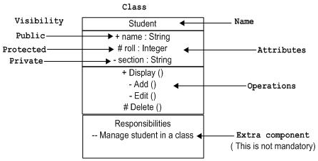

类是用来表示对象，对象可以是任何性质和职责。

**对象表示法:**

该对象表示以同样的方式作为类。唯一的区别是有下划线的名称，如下图所示。

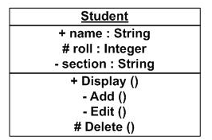

由于对象是实际执行的一类被称为类的实例。因此，它具有相同的使用作为类。

**接口表示法:**

接口是用圆来表示，如下所示。它有一个名称，一般写成下面的圆圈。

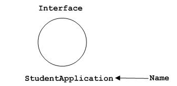

接口是用来描述的功能，而不执行。界面就像一个模板，定义不同的功能不执行。当一个类实现了接口，也按要求实现的功能。

**用例表示法:**

用例表示它里面的一个名字作为 eclipse。它可能包含更多的责任。

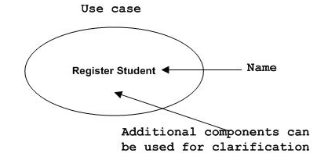

用例是用来捕捉系统的高层次功能。

**角色表示法:**

某些内部或外部的与系统进行交互的实体，可以被定义为一个角色。

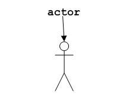

角色是在描述用例图内部或外部实体。

**初始状态表示法：**

初始状态被定义，以显示开始的一个过程。这个符号在几乎所有的图。

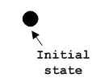

初始状态的表示法的用法是显示的一个过程的起点。

**最终状态表示法：**

最终状态是用来显示的一个过程的结束。这种表示法也可以用来在大部分的图中描述的目的。

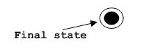

最终状态表示法的用法是显示一个过程的终止点。

**活动类表示法：**

活动类类似于一类具有扎实的边界，活动类一般是用来描述一个系统的并发行为。

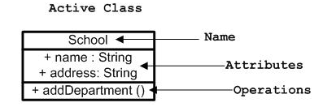

活动类是用来表示在一个系统的并发性。

**元件表示法：**

UML中的一个组件，如下图所示名称里面。在必要时，可以添加额外的元素。

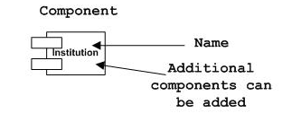

元器件是用来表示系统的任何部分的 UML 图。

**节点表示法：**

UML 中的一个节点表示的一个方盒子，如下图所示，同一个名字。一个节点表示一个物理的系统组件。

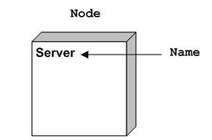

节点用来表示物理系统的一部分，如服务器，网络等。

## 4.2 行为事物：

动态部分是 UML 中最重要的元素之一。 

UML 有一个强大的功能集，代表软件和非软件系统的动态部分。这些功能包括交互和状态机。

相互作用可分为两种类型：

- 顺序（序列图）
- 协作（协作图）

**交互表示法：**

交互基本上是两个 UML 组件之间的信息交换。下图表示交互中使用不同的符号。

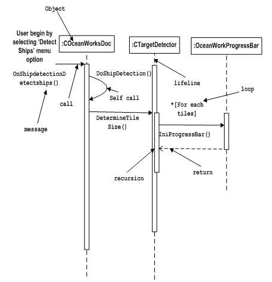

交互是用来表示一个系统的组件之间的通信。

**状态机表示法：**

状态机描述的组件在其生命周期的不同状态。在下面的图中描述的符号。

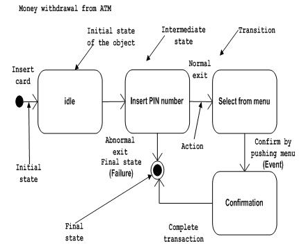

状态机是用来描述一个系统组件的不同状态。状态可以是活动，空闲或任何其他根据情况。

## 4.3 分组事物：

组织的 UML 模型设计的最重要的方面之一。 UML 中只有一个元件即可用于分组，也就是包。

**包表示法:**

包装信息书写方式如下表所示，这是用来包装系统组成部分的。

## 4.4 注释事物：

任一图表中说明的不同的元素和它们的功能是非常重要的。因此，UML 符号注释，以支持这一要求。

**注释表示法:**

这种表示法如下所示，它们被用来提供一个系统的必要的信息。

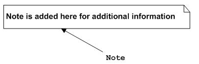

## 4.5 UML 关系

模型是不完整的，正确的描述，除非元素之间的关系。关系给出了一个 UML 模型的意思。

以下是 UML 中提供的不同类型的关系：

- Dependency
- Association
- Generalization
- Extensibility

**依赖表示法：**

依赖是UML元素的一个重要方面。它描述了相关的元素和方向上依赖关系。

依赖关系的虚线箭头表示，如下所示。箭头代表的独立元素，另一端的依赖元素。

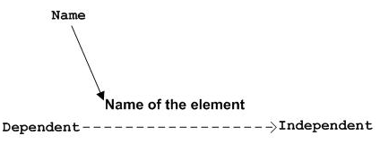

依赖关系是用来表示一个系统的两个元素之间的依赖。

**协作表示法：**

协作介绍 UML 图中的元素相关联。简单的一句话，它介绍了多少个元素参与互动。

联合会（无）两侧的箭头的虚线表示。两端代表两个相关联的元素，如下所示。在两端（1，*等）的多样性也提到多少对象相关。

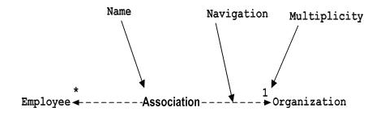

协作是用来表示一个系统的两个元素之间的关系。

**泛化表示法：**

泛化介绍了面向对象世界的继承关系。这是父与子的关系。

泛化为代表的空心箭头，如下图所示箭头的一端表示的父元素而另一端表示子元素。

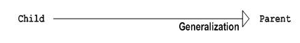

泛化是用来描述一个系统的两个元素的亲子关系。

**可扩展性表示法:**

所有的语言（编程或模型）有某种机制来扩展与其功能类似的语法，语义等。 UML 具有以下机制来提供可扩展性功能。

- 定型观念(代表新元素)
- 标记值 (代表新的属性)
- 约束 (代表界限)

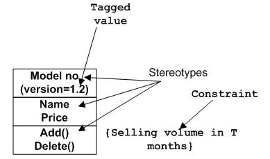

可扩展标记基本上是用来表示一些额外的系统行为的附加元素。这些额外的行为，不包括可用的标准符号。