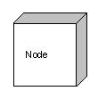
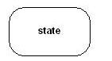

# 1. UML概述

## 1.1 什么是 UML？

UML 是 OMG 在1997年1月提出了创建由对象管理组和 UML1.0 规范草案；

UML 是一种为面向对象开发系统的产品进行说明、可视化、和编制文档的标准语言；

UML 作为一种模型语言，它使开发人员专注于建立产品的模型和结构，而不是选用什么程序语言和算法实现；

UML 是不同于其他常见的编程语言，如C + +，Java中，COBOL等，它是一种绘画语言，用来做软件蓝图；

UML 不是一种编程语言，但工具可用于生成各种语言的代码中使用UML图；

UML 可以用来建模非软件系统的处理流程，以及像在一个制造单元等.

## 1.2 UML 的目标：

UML 的目标是定义一些通用的建模语言并对这些建模语言做出简单的说明，这样可以让建模者理解与使用。UML 也是为普通人和有兴趣的人而开发的系统，它可以是一个软件或者使用非软件，它必须是明确的。我们不将 UML 作为一个开发方法，而是随着流程做一个成功的系统。

现在我们可以明确的了解 UML 的目标就是 UML 被定义为一个简单的建模机制，帮助我们按照实际情况或者按照我们需要的样式对系统进行可视化；提供一种详细说明系统的结构或行为的方法；给出一个指导系统构造的模板；对我们所做出的决策进行文档化。

## 1.3 UML 面向对象的概念：

面向对象(Object Oriented,OO)是软件开发方法，面向对象的概念和应用已超越了程序设计和软件开发。我们可以将 UML 描述为面向对象的分析和设计的继任者。

一个对象中包含了数据和控制数据的方法，其中数据表示对象的状态，类描述的对象，他们也形成层次结构模型真实世界的系统。表示为继承层次结构，也可以以不同的方式按要求相关的类。

对象是现实世界的实体存在我们周围像抽象，封装，继承，多态的基本概念，都可以使用UML表示。因此，UML 是强大到足以代表所有的概念存在于面向对象的分析和设计。 

UML 图是面向对象的概念的表示，因此，学习UML之前，详细了解面向对象的概念就变得非常重要。

以下是一些面向对象基本概念：

- **对象:** 对象代表一个实体的基本构建块.
- **类:** 类是对象的蓝图.
- **抽象化:** 抽象代表现实世界中实体的行为.
- **封装:** 封装是将数据绑定在一起，并隐藏他们外部世界的机制。
- **继承:** 继承是从现有的机制作出新的类。
- **多态性:** 定义的机制来以不同的形式存在.

# 2. UML快速学习指南

## 2.1 UML 注释:

UML 中最重要的建模元素是符号。

适当有效地使用符号对于一个完整的，有意义的模型来说是非常重要的。如果一个模型的目的无法正确的描绘，那么该模型是无用的。

因此，在开始学习 UML 的时候就要强调表示法的重要性，不同的符号可用于表示物件和关系。

可扩展性是 UML 的另一个重要的特点，这使得UML更加强大和灵活。

## 2.2 UML 核心:

UML 的核心是图表，大致可以将这些图归类为结构图和行为图。

- 结构图是由静态图，如类图，对象图等静态图；
- 行为图是由像序列图，协作图等动态图；

一个系统的静态和动态特性是通过使用这些图的可视化。

## 2.3 UML 类图:

类图是使用面向对象的社会最流行的 UML 图。它描述了在一个系统中的对象和他们的关系，能够让我们在正确编写代码以前对系统有一个全面的认识。

一个单独的类图描述系统的一个具体方面，收集类图表示整个系统。基本上，类图表示系统的静态视图。

类图是唯一可以直接映射到面向对象的语言UML图。因此，它被广泛应用于开发者社区。

## 2.4 UML 对象图：

对象图是类图的一个实例。因此，一类图的基本要素是类似的。对象图是由对象和链接。在一个特定的时刻，它捕获该系统的实例。

对象图用于原型设计，逆向工程和实际场景建模。

## 2.5 UML 组件图：

组件图是一种特殊的UML图来描述系统的静态实现视图。组件图包括物理组件，如库，档案，文件夹等。

此图是用来从实施的角度。使用一个以上的元件图来表示整个系统。正向和逆向工程技术的使用，使可执行文件组件图。

## 2.6 UML 部署图：

组件图是用来描述一个系统的静态部署视图。这些图主要用于系统工程师。

部署图是由节点和它们之间的关系。一个高效的部署图是应用软件开发的一个组成部分。

## 2.7 UML 用例图:

用例图是从用户角度描述系统功能，并指出各功能的操作者，用来捕捉系统的动态性质。

一个高层次的设计用例图是用来捕捉系统的要求，因此它代表系统的功能和流向。虽然用例图的正向和反向工程是不是一个很好的选择，但他们仍然在一个稍微不同的方法来模拟它。

## 2.8 UML 交互图：

交互图，用于捕获系统的动态性质。

交互图包括序列图和协作图，其中：序列图显示对象之间的动态合作关系，它强调对象之间消息发送的顺序，同时显示对象之间的交互；协作图描述对象间的协作关系，协作图跟时序图相似，显示对象间的动态合作关系。

## 2.9 UML 状态图：

状态图是一个用于模拟系统的动态性质的五个图。这些图用来模拟一个对象的整个生命周期。

一个对象的状态被定义为对象所在的条件下，特定的时间和对象移动对其他状态，在某些事件发生时。状态图还用于正向和反向工程。

状态图着重描述从一个状态到另一个状态的流程，主要有外部事件的参与。

## 2.10 UML 活动图：

活动图是 UML 的动态模型的一种图形，一般用来描述相关用例图，活动图是一种特殊的状态图。

准确的活动图定义：活动图描述满足用例要求所要进行的活动以及活动间的约束关系，有利于识别并行活动。活动图是一种特殊的状态图，它对于系统的功能建模特别重要，强调对象间的控制流程。

# 3. UML构建模块

复习上节内容，在上节内容中我们知道 UML 的概念模型需要掌握的三大要素是：

- UML构建模块
- 规则连接构建模块
- UML的公共机制

本节讲解 UML 构建模块的所有要素，UML 的构建块的定义如下：

- 事物
- 关系
- 图

## 3.1 事物:

事物是是实体抽象化的最终结果，是 UML 构建块最重要的组成部分，事物的分类如下:

- 结构事物
- 行为事物
- 分组事物
- 注释事物

### 3.1.1 结构事物:

结构事物是模型中的静态部分，用以呈现概念或实体的表现元素，是软件建模中最常见的元素，接下来是对结构化物件的简要描述：

**类**

类是指具有相同属性、方法、关系和语义的对象的集合；

**接口**

接口是指类或组件所提供的服务（操作），描述了类或组件对外可见的动作；

**协作**

协作定义元素之间的相互作用；

**用例**

用例定义了执行者（在系统外部和系统交互的人）和被考虑的系统之间的交互来实现的一个业务目标；

**组件**

组件描述物理系统的一部分；

**节点**

一个节点可以被定义为在运行时存在的物理元素；

### 3.1.2 行为事物:

行为事物指的是 UML 模型中的动态部分，代表语句里的 "动词"，表示模型里随着时空不断变化的部分，包含两类：

**交互:**

交互被定义为一种行为，包括一组元素之间的消息交换来完成特定的任务。

**状态机:**

状态机由一系列对象的状态组成，它是有用的，一个对象在其生命周期的状态是很重要的。

### 3.1.3 分组事物:

可以把分组事物看成是一个"盒子"，模型可以在其中被分解。目前只有一种分组事物，即包（package）。结构事物、动作事物甚至分组事物都有可能放在一个包中。包纯粹是概念上的，只存在于开发阶段，而组件在运行时存在。

**包:**

封装是唯一一个分组事物可收集结构和行为的东西。