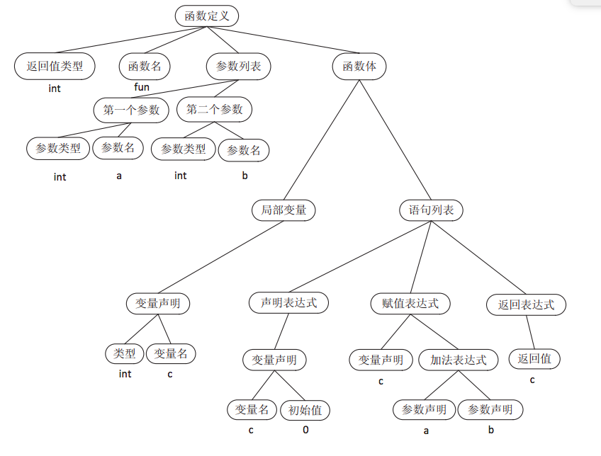

# 编译原理笔记

## 1.程序如何被机器识别

机器只能识别`010101`这样的机器码，使用高级语言编写的程序，必须转换成机器码才能够被机器识别。

高级语言程序转换成机器码经历了以下几个步骤：

- 预编译（Propressing）
- 编译（Compilation）
- 汇编（Assembly）
- 链接（Linking）


接下来依次讲解这个几个步骤的详细过程。

### 1.1 预编译

对于 C 语言而言，源代码文件 hello.c 和头文件 stdio.h 等会被`预编译器 cpp` 预编译成一个 .i 文件。

> 对于 C++ 程序来说，源代码文件拓展名可能是 .cpp 或 .cxx，头文件拓展名可能是 .hh，预编译后的文件拓展名是 .ii。

**预编译过程的主要工作**

预编译过程主要处理那些源代码文件中的以“#”开头的`预编译指令`。比如 #include、#define 等。

- 删除所有的 #define，并展开所有的宏定义。
- 处理所有的`条件预编译指令`，比如 #if、#ifdef、#elif、#else、#endif。
- 处理 #include 预编译指令，将被包含的文件插入到该预编译指令的位置。（这个过程是递归进行的，即被包含的文件可能还包含其它文件）。
- 删除所有的注释，比如 //。
- 添加行号和文件名标识，比如 #2 “hello.c” 2，以便于编译时编译器产生调试用的行号信息以及用于编译时产生编译错误或警告时能显示行号。
- 保留所有的 #pragma 编译器指令，因为编译器需要使用它们。

**输出结果：**经过预编译后的 .i 文件不包含任何宏定义，因为所有的宏已经被展开，并且包含的文件也已经被插入到 .i 文件中。所以当我们无法判断宏定义是否正确或头文件包含是否正确时，可以查看预编译后的文件来确定问题。

### 1.2 编译

编译是整个程序构建的核心部分，也是最复杂的部分之一。编译主要有以下几个步骤：

- 词法分析
- 语法分析
- 语义分析
- 中间代码生成
- 目标代码生成
- 优化


以下面这段 C 语言程序为例，描述从源代码（Source Code）到最终目标代码（Final Target Code）的过程。

```c
// CompilerExpression.c
array[index] = (index + 4) * (2 + 6)
```

#### 1.2.1 词法分析

首先源代码被输入到**扫描器（Scanner）**，扫描器的任务很简单，只是简单地进行词法分析，运用一种类似于**[有限状态机（Finite State Machine）](https://baike.baidu.com/item/非确定有限状态自动机/22735760?fr=aladdin)**的算法将源代码的字符序列分割成一系列的记号（Token）。

以上述代码为例，总共包含了28个非空字符，经过扫描后，产生了16个记号。

| 记号  | 类型     |
| :---- | :------- |
| array | 标识符   |
| [     | 左方括号 |
| index | 标识符   |
| ]     | 右方括号 |
| =     | 赋值     |
| (     | 左圆括号 |
| index | 标识符   |
| +     | 加号     |
| 4     | 数字     |
| )     | 右圆括号 |
| *     | 乘号     |
| (     | 左圆括号 |
| 2     | 数字     |
| +     | 加号     |
| 6     | 数字     |
| )     | 右圆括号 |

**词法分析输出结果：**二元组的形式，即（单词种别，单词自身的值），其中单词种别通常用整数编码来表示。

**状态转换图：**是一张有限方向图。

- 节点代表状态，用圆圈表示。
- 状态之间用箭弧连接，箭弧上的标记（字符）代表可能出现的输入字符或字符类。
- 一张转换图只包含有限个状态，其中有一个为初态，至少有一个终态。
- 箭头表示初态，双圈表示终态。

> 若存在一条从初态到某一终态的路线，且这条路线上所有弧上的标记连接成的字符等于 α，则成 α 被该状态转换图所识别（接收）。

示例：从状态1出发，读入一个字母以后，就转入状态2，在状态2上面，如果继续读入的是数字或者字母，就会回到状态2。直到读入一个不是数字或字母的字符，就转到了状态3。状态3是一个终态，表示完成了一个单词的识别。

注：* 号表示最后一个读入的字符不属于这个单词，要把它退回去。


代码实现：

```c
int code, value;
strToken = ""; // 存放字符串
GetChar(); // 读取下一个字符
GetBC(); // 跳过空白符，直至读入非空白符

if (IsLetter()) // 是否是字母
begin
	while (IsLetter() or IsDigit()) // 是否是字母或数字
	begin
		Concat(); // 把字符拼到 strToken 后
		GetChar();
	end
	Retract();
	code := Reserve();
	if (code = 0)
	begin
		value := InsertId(strToken);
		return ($ID, value);
	end
	else
		return (code, -);
end
```

词法分析产生的记号一般可以分为一下几类：关键字、字面量（包含数字、字符串等）和特殊符号（如加号、等号）。

在识别记号的同时，扫描器也完成了其他工作。如：将标识符存放到符号表，将数字、字符串常量存放到文字表等，以备后面的步骤使用。

有一个名为lex的程序可以实现词法扫描，它会按照用户之前描述好的词法规则将输入的字符串分割成一个个记号。正因为有这样一个程序存在，编译器的开发者就无需为每个编译器开发一个独立的词法扫描器，而是根据需要改变词法规则即可。

#### 1.2.2 语法分析

我们都知道，在使用某一种程序设计编写程序时，都要遵循一套特定的规则。比如，在C语言中，一个程序由多个函数组成，一个函数由声明和语句组成，一个语句由表达式组成等等。这组规则精确描述了一个良构的程序设计语言的语法。语法分析器能够确定一个源程序的语法结构，能够检测出源程序中的语法错误，并且能够从常见的错误中恢复并继续处理程序的其余部分。

一个语法分析器从词法分析器获得一个词素序列，并验证这个序列是否可以由源语言的文法生成。语法分析器会构造一棵语法分析树，并把它传递给编译器的其他部分进一步处理，在构建语法分析树的过程中，就验证了这个词素序列是否符合源语言的文法。语法分析器在编译器中的位置如下图：


首先需要掌握几个概念：

**终结符与非终结符**

非终结符：

> 非终结符是可以再分解和定义的，非终结符对应语言各层次的句法单位，可以由终结符和非终结符共同组成。非终结符集合和终结符集合是不相交的。一个形式文法中必须有一个起始符号，这个起始符号属于非终结符的集合。

终结符：

> 详细一点说：终结符是一个形式语言的基本符号。就是说，它们能在一个形式语法的推导规则的输入或输出字符串存在，而且它们不能被分解成更小的单位。确切地说，一个语法的规则不能改变终结符。

**上下文无关文法**

一个上下文无关文法（下文简称文法）由终结符号、非终结符号、一个开始符号和一组产生式组成：


对于产生式头相同的两个或多个产生式，可以把它们的产生式体用“|”连接写成一个产生式。例如，对产生式`E→E+T`和`E→T`，可以写成`E→E+T|T`。

类比：

```c
<句子>
=> <主语><谓语><间接宾语><直接宾语>
=> <代词><谓语><间接宾语><直接宾语>
=> He <谓语><间接宾语><直接宾语>
=> He gave <间接宾语><直接宾语>
=> He gave me <代词><直接宾语>
=> He gave me <直接宾语>
=> He gave me <冠词><名词>
=> He gave me a <名词>
=> He gave me a book

这是一个英文句子的语法分析过程，其中<主语><谓语>可以再分解，可以把它们理解为非终结符。

He gave me 是具体的单词，不可以再分解，可以理解为终结符。
```

**语法分析的方法主要有两类**

**语法分析的方法主要有两类**

1.自下而上（Bottom-up）

- 从输入串开始，逐步进行规约，直到文法的开始符号
- 规约：根据文法的产生式规则，把串中出现的产生式的右部替换成左部符号（是推导的逆过程）
- 从叶节点开始，构造语法树
- 算法优先分析法、LR分析法

2.自上而下（Top-down）

- 从文法的开始符号出发，反复使用各种产生式，寻找“匹配”的推导
- 推导：根据文法的产生式规则，把串中出现的产生式的左部符号替换成右部符号
- 从树的根节点开始，构造语法树
- 递归下降分析法、预测分析程序

**自上而下分析**

基本思想：

> 从文法的开始符号出发，向下推导，推出句子
> 针对输入串，试图用一切可能的办法，从文法开始符号（根节点）出发，自上而下地为输入串建立一颗语法树
> （这个过程本质上是一个试探的过程）

**自上而下分析示例**

```C
假定有文法 G(S):
	(1) S -> xAy
	(2) A -> **|*    (|表示或)
	
分析输入串 x*y （记为 α）

(1)IP 指针用来读取单词

x*y	 S
↑
IP

(2)把 S 推导为 xAy

x*y	 S
↑      / | \
IP     x A Y
       ↑
       
(3)读取 A

x*y	 S
 ↑     / | \
IP     x A Y
         ↑
	     
(4)把 A 推导为 **

x*y	 S
 ↑     / | \
IP     x A Y
        / \
        *  *
        ↑

(5)继续读取单词 y

x*y	 S
  ↑    / | \
 IP    x A Y
        / \
        *  *
           ↑
	       
(6)不符合，进行回溯

x*y	 S
 ↑     / | \
IP     x A Y
         ↑

(7)把 A 推导为 *

x*y	 S
 ↑     / | \
 IP    x A Y
         |
         *
         ↑

(8)读取下一单词

x*y	 S
  ↑    / | \
 IP    x A Y
         |
         *
         ↑

S已经拓展到了所有叶节点，并且都匹配成功，可以断言这个输入串是一个合格的句子。
```

**自上而下分析面临的问题**

1.回溯问题（使分析工作变得复杂）

- 分析过程中，当一个非终结符用某一个候选匹配成功时，这种匹配可能是暂时的
- 匹配失败时，不得不进行回溯

2.文法左递归问题（使分析工作陷入死循环）

[

**构造不带回溯的自上而下分析算法**

- 消除文法的左递归
- 消除回溯

**1.消除左递归：把左递归变右递归**

P -> Pα|β

```C
左递归的情况：

P => Pα
  => Pαα
  ...
  => βαα...α

最终产生的串是以 β 开头后接 α 的串
```

解决方法：左递归变右递归

P -> βP’

P’ -> αP’|ε

```c
P => βP'
  => βαP'
  => βααP'
  ...
  => βαα...αP'
  => βαα...α

最终产生的串也是以 β 开头后接 α 的串
```

左递归会把程序带入死循环，右递归会吗？

> 右递归的非终结符是在最右边，它的左边 α 会不断地产生终结符，如果分析的句子是一个正确的句子的话，左边的 α 的终结符会跟当前的输入串中的单词进行匹配，从而使得这个输入串不断地被读入，分析进程不断地推进，所以不会陷入一种死循环的地步，因为总有一天所有的单词都会被分析完。

**语法分析的过程**

**语法分析器（Grammar Parser）**将对由扫描器产生的记号进行语法分析。从而产生**语法树（Syntax Tree）**。整个分析过程采用了上下文无关语法（Context-freeGrammar）的分析手段。简单地讲，由语法分析器生成的语法树是以表达式（Expression）为节点的树。

```c
int fun(int a, int b) {
    int c = 0;
    c = a + b;
    return c;
}
```

以上述代码为例，其中的语句就是一个由赋值表达式、加法表达式、乘法表达式、数组表达式、括号表达式组成的复杂语句，下图所示为该语句经过语法分析器后生成的语法树。

[](https://upload-images.jianshu.io/upload_images/4146031-62bda7bf4f38e87d.png)

在语法分析的同时，很多运算符号的优先级和含义也被确定下来了。如：乘法表达式的优先级比加法高，圆括号表达式的优先级比乘法高，等等。另外，有些符号具有多重含义，如“*”在C语言中可以表示乘法表达式，也可以表示对指针取内容的表达式，因此语法分析阶段必须对这些内容进行区分。如果出现了表达式不合法，如各种括号不匹配、表达式中缺少操作符等，编译器就会报告语法分析阶段的错误。

有一个名为yacc（Yet Another Compiler Compiler）的工具可以实现语法分析。其根据用户给定的语法规则对输入的记号序列进行解析，从而构建出语法树。对于不同的编程语言，编译器的开发者只需改变语法规则，而无需为每个编译器编写一个语法分析器。因此，其也称为“编译器编译器（Compiler Compiler）”

#### 1.2.3 语义分析

source：[https://hzsss.github.io/%E7%BC%96%E8%AF%91%E5%8E%9F%E7%90%86%E7%AC%94%E8%AE%B0/#3-%E8%AF%AD%E4%B9%89%E5%88%86%E6%9E%90](https://hzsss.github.io/编译原理笔记/#3-语义分析) 